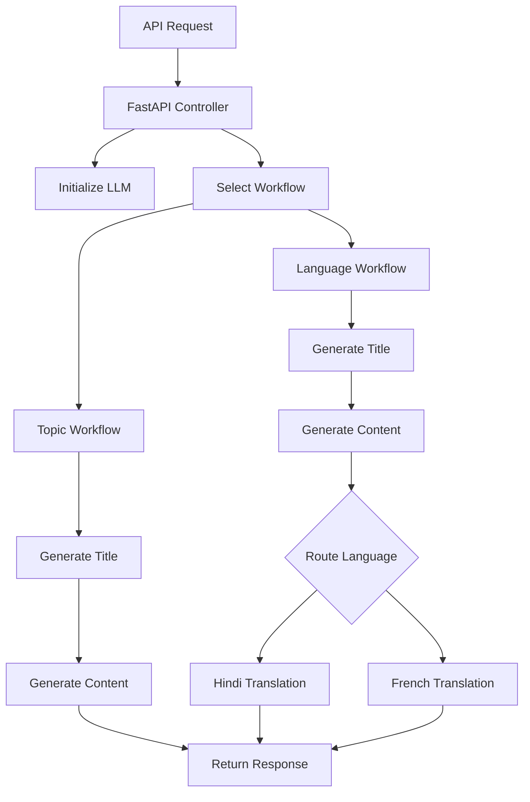
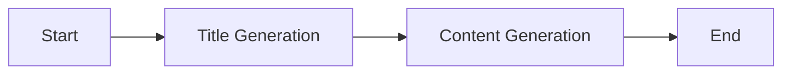
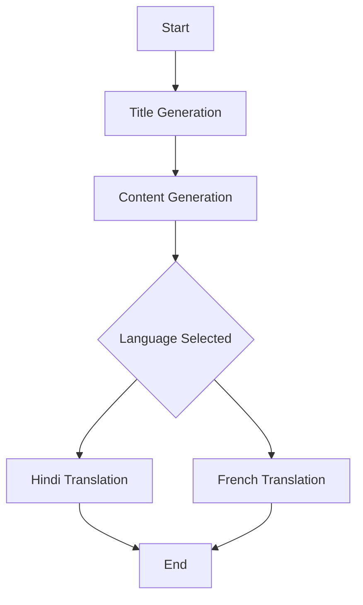

# 🚀 Agentic Blog Generator API

> **Graph-based AI system for automated blog generation and multilingual translation using LangGraph and Groq LLM**

---

## 🌟 Overview

Content generation systems often lack **structure, control, and extensibility** when scaling across workflows like SEO optimization and multilingual publishing.

This project solves that by building a **stateful, graph-driven Agentic AI system** using LangGraph that:

* Generates **SEO-optimized blog titles**
* Produces **structured long-form content**
* Dynamically performs **language translation via conditional routing**
* Exposes the entire workflow through a **production-ready FastAPI service**

👉 The result is a **modular, extensible AI pipeline** that mirrors real-world content automation systems.

---

## 🧠 Tech Stack

* **LangGraph** – Stateful workflow orchestration
* **LangChain** – LLM abstractions
* **Groq LLM (LLaMA 3.1 8B Instant)** – High-speed inference
* **FastAPI** – API layer
* **Pydantic** – Data validation
* **Uvicorn** – ASGI server
* **Python 3.10+**

---

# 🏗️ Architecture



---

# ⚙️ How It Works

### 🔄 End-to-End Flow

1. User sends request via API
2. FastAPI initializes:

   * Groq LLM
   * LangGraph workflow
3. System selects execution path:

   * Topic-only → Basic pipeline
   * Topic + language → Conditional pipeline
4. Graph executes step-by-step:

   * Title generation
   * Content generation
   * Optional translation
5. Returns structured blog response

---

# 📂 Project Structure

```bash
.
├── app.py
├── src/
│   ├── Graphs/
│   │   └── graph_builder.py
│   ├── Nodes/
│   │   └── blog_node.py
│   ├── States/
│   │   └── blogstate.py
│   └── LLMs/
│       └── groqllm.py
├── .env
├── requirements.txt
└── README.md
```

---

# 🎯 Key Features / Use Cases

## ✍️ Automated Blog Generation

* Generates **SEO-friendly titles**
* Produces **structured long-form content**

## 🌍 Multilingual Content Pipeline

* Supports:

  * Hindi
  * French
* Easily extensible to more languages

## 🧠 Agentic Workflow Execution

* Graph-based decision making
* Dynamic execution paths
* State-aware processing

## 🔄 Conditional Routing

* Automatically selects translation node
* Demonstrates real-world AI orchestration

## ⚡ API-First Design

* Fully accessible via REST API
* Easy integration into external systems

---

# 🧩 Workflow Design (LangGraph)

## 🔹 Topic-Based Pipeline



---

## 🔹 Language-Aware Pipeline



---

# 🚀 Installation

## 1️⃣ Clone Repository

```bash
git clone https://github.com/awasthi-anjali/Blog-Generation-and-Translation.git
cd agentic-blog-generator
```

## 2️⃣ Create Virtual Environment

```bash
python -m venv venv
source venv/bin/activate      # mac
venv\Scripts\activate         # windows
```

## 3️⃣ Install Dependencies

```bash
pip install -r requirements.txt
```

## 4️⃣ Setup Environment Variables

Create `.env` file:

```env
GROQ_API_KEY=your_api_key
LANGCHAIN_API_KEY=your_langsmith_key
```

---

## ▶️ Run Server

```bash
python app.py
```

Server runs at:

```
http://localhost:8000
```

---

# 🧪 API Usage

### 🔹 Request

```json
POST /blogs

{
  "topic": "Future of AI",
  "language": "french"
}
```

---

### 🔹 Response

```json
{
  "data": {
    "blog": {
      "title": "...",
      "content": "..."
    }
  }
}
```

---

# 📊 Why This Project Stands Out

* ✔️ **Graph-based AI system design (LangGraph)**
* ✔️ **Stateful workflow execution**
* ✔️ **Dynamic conditional routing**
* ✔️ **Multi-step LLM pipelines**
* ✔️ **API-first production architecture**
* ✔️ **Modular and scalable design**

👉 Demonstrates strong **system design + applied AI engineering**

---

# 🔮 Future Improvements

* Add more language support
* Integrate vector database for context-aware blogs
* Add memory persistence
* Introduce multi-agent collaboration
* Deploy on AWS with API Gateway
* Add streaming responses

---

# 📌 Resume-Ready Summary

> Built a **stateful Agentic AI system using LangGraph** to automate blog generation and multilingual translation. Designed graph-based workflows with conditional routing, integrated Groq LLM for high-speed inference, and exposed the system via a production-ready FastAPI service.


