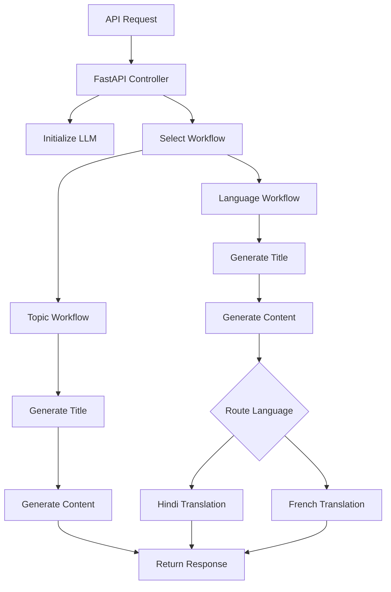
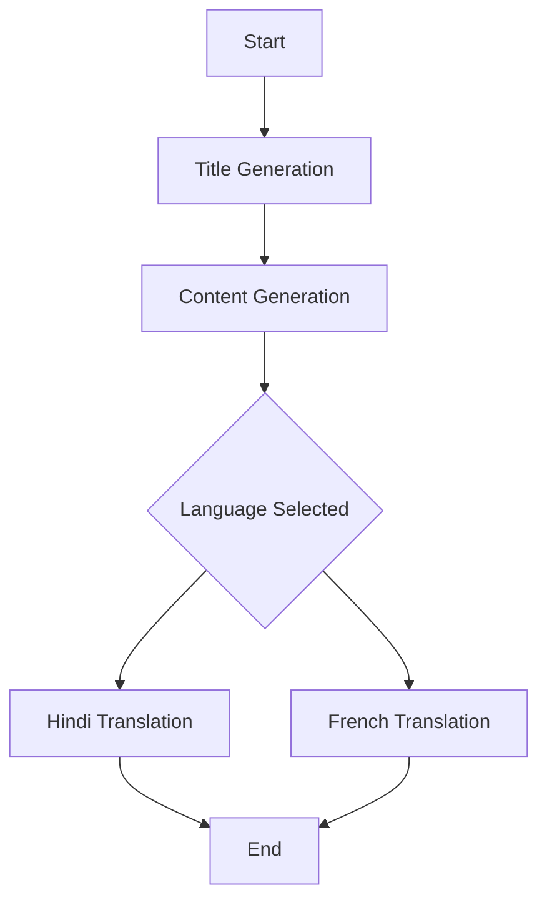

# Agentic Blog Generator (LangGraph + Groq + FastAPI)

An AI-powered blog generation app built with LangGraph workflows, Groq LLM, and FastAPI.

It supports:
- Blog title + content generation from a topic
- Optional language translation (`hindi` / `french`)
- Swagger testing with typed request/query parameters
- Frontend UI for generate + history + view + delete
- SQLite persistence for generated blogs

---

## Features

- **Topic-based generation** using LangGraph nodes
- **Language routing** with conditional translation graph
- **Markdown output** rendered properly in frontend
- **Persistence** in local SQLite (`blogs.db`)
- **History management**:
  - List recent blogs
  - View full saved blog in UI
  - Delete individual history entries

---

## Architecture

### 1) Topic Flow
`START -> title_creation -> content_generation -> END`

### 2) Language Flow
`START -> title_creation -> content_generation -> route -> (hindi_translation | french_translation) -> END`

---

## Tech Stack

- Python 3.10+
- FastAPI
- Pydantic
- Uvicorn
- LangGraph
- LangChain
- Groq LLM (`llama-3.1-8b-instant`)
- SQLite
- HTML/CSS/JavaScript frontend

---

## Project Structure

```text
.
├── app.py
├── blogs.db                  # created automatically on first run
├── frontend/
│   └── index.html
├── src/
│   ├── Graphs/
│   │   └── graph_builder.py
│   ├── Nodes/
│   │   └── blog_node.py
│   ├── States/
│   │   └── blogstate.py
│   └── LLMs/
│       └── groqllm.py
├── requirements.txt
└── README.md
```

---

## Installation

1. Clone repository
2. Create virtual environment
3. Install dependencies
4. Add environment variables
5. Run server

```bash
git clone https://github.com/awasthi-anjali/Blog-Generation-and-Translation.git
cd agentic-blog-generator

python -m venv venv
# Windows
venv\Scripts\activate
# macOS/Linux
# source venv/bin/activate

pip install -r requirements.txt
```

Create `.env`:

```env
GROQ_API_KEY=your_groq_api_key
LANGCHAIN_API_KEY=your_langsmith_api_key
```

Run:

```bash
python app.py
```

Server:
- App UI: `http://localhost:8000`
- Swagger: `http://localhost:8000/docs`

---

## API Endpoints

### `GET /`
Serves frontend UI (`frontend/index.html`).

### `POST /blogs`
Generate blog from JSON body.

Request:
```json
{
  "topic": "Future of AI",
  "language": "french"
}
```

Notes:
- `topic` is required
- `language` is optional (`hindi` / `french`)

### `GET /blogs`
Generate blog from query parameters.

Example:
`/blogs?topic=Future%20of%20AI&language=hindi`

### `GET /blogs/history`
Returns recent saved blogs from SQLite.

Query:
- `limit` (default: `20`, min: `1`, max: `100`)

### `DELETE /blogs/{blog_id}`
Deletes one saved blog entry by `id`.

---

## Data Persistence

Generated blogs are stored in:
- File: `blogs.db`
- Table: `blog_history`

Stored columns:
- `id`
- `topic`
- `language`
- `title`
- `content`
- `created_at` (UTC ISO format)

The app initializes the table automatically on startup.

---

## Frontend Behavior

- **Generate Blog**: shows generated blog output section
- **Check History**: shows history section only
- **Hide History**: hides history section
- **View** (history item): opens selected saved blog in main output panel
- **Delete** (history item): removes saved blog from DB and refreshes list

---

## Notes

- Translation node translates both **title** and **content** when language is selected.
- Markdown from LLM output is rendered in UI.
- SQLite DB file is local to this project folder.

# 🚀 Agentic Blog Generator API

> **Graph-based AI system for automated blog generation and multilingual translation using LangGraph and Groq LLM**

---

## 🌟 Overview

Content generation systems often lack **structure, control, and extensibility** when scaling across workflows like SEO optimization and multilingual publishing.

This project solves that by building a **stateful, graph-driven Agentic AI system** using LangGraph that:

* Generates **SEO-optimized blog titles**
* Produces **structured long-form content**
* Dynamically performs **language translation via conditional routing**
* Exposes the entire workflow through a **production-ready FastAPI service**

👉 The result is a **modular, extensible AI pipeline** that mirrors real-world content automation systems.

---

## 🧠 Tech Stack

* **LangGraph** – Stateful workflow orchestration
* **LangChain** – LLM abstractions
* **Groq LLM (LLaMA 3.1 8B Instant)** – High-speed inference
* **FastAPI** – API layer
* **Pydantic** – Data validation
* **Uvicorn** – ASGI server
* **Python 3.10+**

---

# 🏗️ Architecture


```mermaid
flowchart TD
    A[API Request] --> B[FastAPI Controller]
    B --> C[Initialize LLM]
    B --> D[Select Workflow]

    D --> E1[Topic Workflow]
    D --> E2[Language Workflow]

    E1 --> F1[Generate Title]
    F1 --> G1[Generate Content]
    G1 --> Z[Return Response]

    E2 --> F2[Generate Title]
    F2 --> G2[Generate Content]
    G2 --> H{Route Language}
    H --> I1[Hindi Translation]
    H --> I2[French Translation]
    I1 --> Z
    I2 --> Z
```

---

# ⚙️ How It Works

### 🔄 End-to-End Flow

1. User sends request via API
2. FastAPI initializes:

   * Groq LLM
   * LangGraph workflow
3. System selects execution path:

   * Topic-only → Basic pipeline
   * Topic + language → Conditional pipeline
4. Graph executes step-by-step:

   * Title generation
   * Content generation
   * Optional translation
5. Returns structured blog response

---

# 📂 Project Structure

```bash
.
├── app.py
├── src/
│   ├── Graphs/
│   │   └── graph_builder.py
│   ├── Nodes/
│   │   └── blog_node.py
│   ├── States/
│   │   └── blogstate.py
│   └── LLMs/
│       └── groqllm.py
├── .env
├── requirements.txt
└── README.md
```

---

# 🎯 Key Features / Use Cases

## ✍️ Automated Blog Generation

* Generates **SEO-friendly titles**
* Produces **structured long-form content**

## 🌍 Multilingual Content Pipeline

* Supports:

  * Hindi
  * French
* Easily extensible to more languages

## 🧠 Agentic Workflow Execution

* Graph-based decision making
* Dynamic execution paths
* State-aware processing

## 🔄 Conditional Routing

* Automatically selects translation node
* Demonstrates real-world AI orchestration

## ⚡ API-First Design

* Fully accessible via REST API
* Easy integration into external systems

---

# 🧩 Workflow Design (LangGraph)

## 🔹 Topic-Based Pipeline


```mermaid
flowchart LR
    A[Start] --> B[Title Generation]
    B --> C[Content Generation]
    C --> D[End]
```

---

## 🔹 Language-Aware Pipeline


```mermaid
flowchart TD
    A[Start] --> B[Title Generation]
    B --> C[Content Generation]
    C --> D{Language Selected}
    D --> E[Hindi Translation]
    D --> F[French Translation]
    E --> G[End]
    F --> G
```

---

# 🚀 Installation

## 1️⃣ Clone Repository

```bash
git clone https://github.com/awasthi-anjali/Blog-Generation-and-Translation.git
cd agentic-blog-generator
```

## 2️⃣ Create Virtual Environment

```bash
python -m venv venv
source venv/bin/activate      # mac
venv\Scripts\activate         # windows
```

## 3️⃣ Install Dependencies

```bash
pip install -r requirements.txt
```

## 4️⃣ Setup Environment Variables

Create `.env` file:

```env
GROQ_API_KEY=your_api_key
LANGCHAIN_API_KEY=your_langsmith_key
```

---

## ▶️ Run Server

```bash
python app.py
```

Server runs at:

```
http://localhost:8000
```

---

# 🧪 API Usage

### 🔹 Request

```json
POST /blogs

{
  "topic": "Future of AI",
  "language": "french"
}
```

---

### 🔹 Response

```json
{
  "data": {
    "blog": {
      "title": "...",
      "content": "..."
    }
  }
}
```

---

# 📊 Important points abou this project

* ✔️ **Graph-based AI system design (LangGraph)**
* ✔️ **Stateful workflow execution**
* ✔️ **Dynamic conditional routing**
* ✔️ **Multi-step LLM pipelines**
* ✔️ **API-first production architecture**
* ✔️ **Modular and scalable design**


---

# 🔮 Future Improvements

* Add more language support
* Integrate vector database for context-aware blogs
* Add memory persistence
* Introduce multi-agent collaboration
* Deploy on AWS with API Gateway
* Add streaming responses

---

#  Summary

> Built a **stateful Agentic AI system using LangGraph** to automate blog generation and multilingual translation. Designed graph-based workflows with conditional routing, integrated Groq LLM for high-speed inference, and exposed the system via a production-ready FastAPI service.


