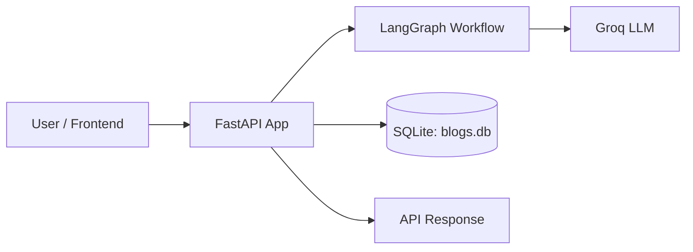
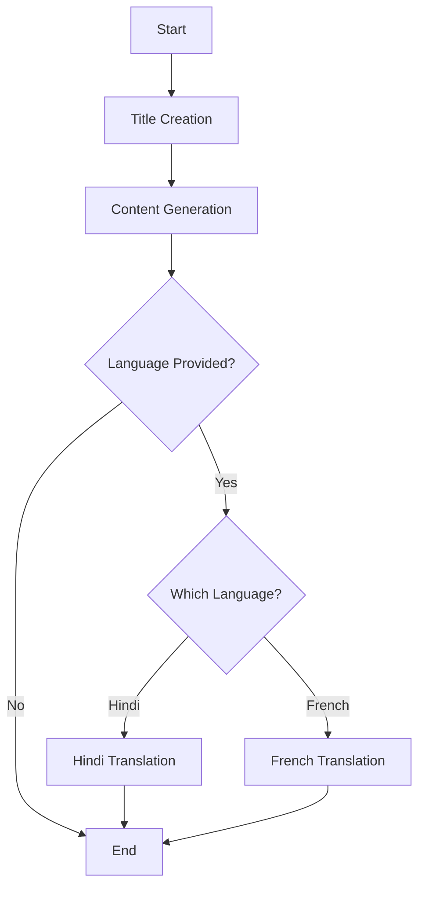
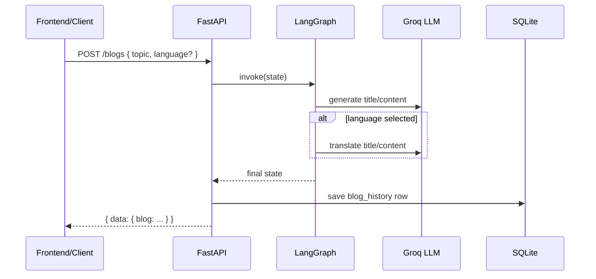

 ## Watch Demo:
 

https://github.com/user-attachments/assets/0b245e62-15b4-4a9b-8b94-c24e001a9434


 
 # Agentic Blog Generator

AI-powered blog generation and optional translation using `LangGraph`, `Groq`, and `FastAPI`.

## Why This Project

Content teams need fast, structured writing workflows that can also localize output for multiple languages.
This project demonstrates a practical agentic pipeline that:

- Generates a blog title and detailed content from a topic
- Routes conditionally to translation nodes (Hindi/French)
- Stores generated blogs in SQLite history
- Exposes everything through a clean REST API + simple frontend

---

## Visual Overview

### 1) System Architecture


```mermaid
flowchart LR
    U[User / Frontend] --> A[FastAPI App]
    A --> G[LangGraph Workflow]
    G --> LLM[Groq LLM]
    A --> DB[(SQLite: blogs.db)]
    A --> R[API Response]
```

### 2) Execution Flow


```mermaid
flowchart TD
    S[Start] --> T[Title Creation]
    T --> C[Content Generation]
    C --> Q{Language Provided?}
    Q -- No --> E[End]
    Q -- Yes --> R{Which Language?}
    R -- Hindi --> H[Hindi Translation]
    R -- French --> F[French Translation]
    H --> E[End]
    F --> E
```

### 3) Request-Response Sequence


```mermaid
sequenceDiagram
    participant UI as Frontend/Client
    participant API as FastAPI
    participant WF as LangGraph
    participant LLM as Groq LLM
    participant DB as SQLite

    UI->>API: POST /blogs { topic, language? }
    API->>WF: invoke(state)
    WF->>LLM: generate title/content
    alt language selected
        WF->>LLM: translate title/content
    end
    WF-->>API: final state
    API->>DB: save blog_history row
    API-->>UI: { data: { blog: ... } }
```

---

## Features

- **Graph-based generation** with clear, extensible nodes
- **Conditional routing** for language translation workflows
- **Markdown rendering** in frontend output panel
- **History management**:
  - View recent generated blogs
  - Open a saved blog in UI
  - Delete individual blog records
- **Persistent storage** via `blogs.db` (`blog_history` table)

---

## Tech Stack

- Python 3.10+
- FastAPI + Pydantic
- LangGraph + LangChain
- Groq (`llama-3.1-8b-instant`)
- SQLite
- HTML/CSS/JavaScript frontend

---

## Project Structure

```text
.
├── app.py
├── blogs.db                      # auto-created on startup
├── frontend/
│   └── index.html
├── src/
│   ├── Graphs/
│   │   └── graph_builder.py
│   ├── Nodes/
│   │   └── blog_node.py
│   ├── States/
│   │   └── blogstate.py
│   └── LLMs/
│       └── groqllm.py
├── requirements.txt
└── README.md
```

---

## Setup

### 1) Clone and enter project

```bash
git clone https://github.com/awasthi-anjali/Blog-Generation-and-Translation.git
cd agentic-blog-generator
```

### 2) Create virtual environment

```bash
python -m venv venv
```

- Windows (PowerShell):

```bash
venv\Scripts\activate
```

- macOS/Linux:

```bash
source venv/bin/activate
```

### 3) Install dependencies

```bash
pip install -r requirements.txt
```

### 4) Configure environment variables

Create `.env` in project root:

```env
GROQ_API_KEY=your_groq_api_key
LANGCHAIN_API_KEY=your_langsmith_api_key
```

### 5) Run app

```bash
python app.py
```

Open:

- UI: `http://localhost:8000`
- Swagger Docs: `http://localhost:8000/docs`

---

## API Reference

### `GET /`

Serves `frontend/index.html`.

### `POST /blogs`

Generate blog from request body.

Request:

```json
{
  "topic": "Future of AI",
  "language": "french"
}
```

Notes:

- `topic` is required
- `language` is optional (`hindi` or `french`)

### `GET /blogs`

Generate blog using query parameters.

Example:

`/blogs?topic=Future%20of%20AI&language=hindi`

### `GET /blogs/history`

Returns recent saved blogs.

Query:

- `limit` (default `20`, min `1`, max `100`)

### `DELETE /blogs/{blog_id}`

Deletes one blog history row by id.

---

## Data Model (SQLite)

Database: `blogs.db`
Table: `blog_history`

Columns:

- `id` (INTEGER PRIMARY KEY AUTOINCREMENT)
- `topic` (TEXT)
- `language` (TEXT)
- `title` (TEXT)
- `content` (TEXT)
- `created_at` (TEXT, UTC ISO timestamp)

---

## Frontend Behavior

- **Generate Blog**: calls API and renders markdown output
- **Check History**: fetches recent entries
- **View**: loads selected saved blog into output panel
- **Delete**: removes selected history item and refreshes list

---

## Future Improvements

- Add more translation languages
- Add streaming token output in UI
- Add authentication and per-user blog history
- Add deployment profile (Docker + cloud target)

---

## Summary

This project is a practical example of agentic AI orchestration with LangGraph: structured generation, conditional translation, API-first design, and persistent history in one workflow.
